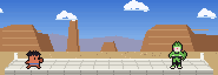

# Notch Fight

Pixel-art anime fights that drop out of the MacBook Pro notch while Claude Code is working.
Claude (the orange asterisk mascot) is always the protagonist.



## Install

Requirements: **macOS** (ideally a MacBook with a notch), Xcode Command Line Tools (`swiftc`),
`python3`. Pillow is installed automatically if missing; `ffmpeg` is optional (GIF previews).

```bash
git clone <this repo> && cd notch-fight
./install.sh        # checks requirements, builds, registers the Claude Code hooks (idempotent)
./uninstall.sh      # removes the hooks and stops the app (--purge also deletes build/ + config)
./clips.sh          # choose which clips play (see "Choosing clips")
# several Claude profiles? NOTCH_FIGHT_CLAUDE_DIRS=~/.claude-work:~/.claude-personal ./install.sh (same for uninstall)
```

Or just ask Claude Code in this repo: *"install this"* — `CLAUDE.md` tells it what to do.

**Platforms:** the app is macOS-only (Swift/AppKit + the notch API). The clip generator
(`src/`, Python + Pillow) runs anywhere. On a Mac without a notch the panel hangs from the top
centre with the default 185 pt width. A Linux port would only need a new player (e.g. a GTK
always-on-top borderless window) reading the same `build/clips` PNGs.

## How it works

- `NotchFight.app` hangs a black panel from the notch's bottom edge (width = notch width,
  detected at runtime via `NSScreen.auxiliaryTopLeftArea/RightArea`) and plays the clips.
- Clicking the panel, or `SIGTERM` (`pkill -x NotchFight`), retracts it into the notch and quits.
- Claude Code hooks in `$CLAUDE_CONFIG_DIR/settings.json` (default `~/.claude`; for several profiles: `NOTCH_FIGHT_CLAUDE_DIRS=~/.claude-work:~/.claude-personal ./install.sh`) drive it:
  - `UserPromptSubmit` → `scripts/notch-hook.sh start` (marks the session as working, opens the app)
  - `Stop` / `StopFailure` / `SessionEnd` → `scripts/notch-hook.sh stop`
- Several sessions can work at once (even across profiles): each one leaves a marker in
  `~/.config/notch-fight/sessions/` with its `claude` PID, and the panel retracts only when the
  last one stops. The app also drops markers of dead PIDs (e.g. a closed terminal never fires
  `Stop`). An interrupted turn (Esc) doesn't fire `Stop` either: the panel stays until that
  session's next turn ends, or click it.

## Themes and loop keyframes

Each theme has its own neutral pose (the "loop keyframe"). Every clip of a theme starts and
ends on it, so clips of the same theme chain seamlessly. Switching theme plays a
pre-rendered asterisk-iris transition (`transitions/<from>__<to>`).

| Theme | Claude as | Opponent | Clips |
|---|---|---|---|
| `dbz` | Claude (goes Super Saiyan) | Perfect Cell, on the Cell Games ring | cellgames |
| `ygo` | Yugi-style duelist (D-D-D-DUEL and Heart of the Cards close-ups, Dark Magician card reveal, Mirror Force) | Kaiba + Blue-Eyes White Dragon hologram, in the Kaiba Corp stadium (life points 8000 to 0) | duel |
| `kny` | Tanjiro-style swordsman (Water Breathing dragon and Hinokami Kagura close-ups) | Akaza (kanji-eye close-up), on the Mugen Train roof; beheaded, crumbles to ash | breath |
| `jjk` | Gojo at the Shibuya crossing on 10.31 (Infinity stops Dismantle and the lunge — MUGEN, blindfold-off SIX EYES close-up, Blue, Red, HOLLOW PURPLE close-up erases the street) | Sukuna (Dismantle slashes, blown into the 109 tower, reforms from cursed motes) | infinity |
| `fn` | Jonesy with a pickaxe (cranks 90s to high ground, wood-edit shotgun close-up — 200 HEADSHOT, #1 VICTORY ROYALE crown card, default dance) | Geno, on the island (Tilted Towers skyline, Battle Bus overhead, the storm wall closing in; AR, rocket, eliminated into cubes) | royale |
| `pkm` | Claude in Ash's cap on a GBA battle screen (FIGHT menu, HP/EXP boxes; Quick Attack, Shadow Ball — SUPER EFFECTIVE close-up, levels up, YOU WIN!, Poke Ball GO! close-up) | Mewtwo on the far platform (Psychic warps the screen, faints, a wild one appears) | psychic |
| `snk` | Survey Corps scout (ODM gear) | a grinning Titan in Trost (red roofs, church spire, the Wall; grin + crossed-blades close-ups, SHINZOU WO SASAGEYO!, nape slash, steam) | survey |
| `nrt` | Naruto in the Hidden Leaf under the Hokage faces (hand-seal close-up, shadow clones, leaps the Great Fireball, Rasengan close-up) | Madara (gunbai swats the clones, Sharingan close-up, Katon) | shadowclone |
| `naruto-edo` | Naruto on the Fourth Great Ninja War battlefield (clones, Rasengan, Sage Mode close-up, Rasenshuriken wind dome) | Kabuto + Edo Tensei'd Codex, OpenCode, Grok (coffin close-up, paper-dust regeneration) | edotensei |
| `naruto-zabuza` | Kakashi (Sharingan close-up, copied jutsu) | Zabuza on the lake (Water Dragons clash, Great Waterfall) | waterdragon |
| `dbz-buu` | Claude, then Clodex (fusion dance with Codex, FU-SION-HA! close-up, goes blue for the Final Kamehameha) on the Supreme Kai's world | Kid Buu (grin close-up, planet-destroying ball, regenerates) | fusion |
| `jjk-sukuna` | Gojo in ruined Shibuya under a red moon (hand-sign close-up with one Six Eye, Unlimited Void swallows the shrine, four Black Flashes) | Sukuna (grin close-up with four eyes, Malevolent Shrine, Dismantle + Cleave storm) | domain |
| `hxh` | Gon (fishing rod, adult form close-up) | Neferpitou (Terpsichora) | jajanken |
| `fma` | Colonel Mustang (glove snap close-up, flame alchemy) | Envy (disguised as Claude, burned to his true form) | flame |
| `dbz-jiren` | Claude in Ultra Instinct (silver-eyes close-up, dodges everything, instant hits from everywhere) at the Tournament of Power | Jiren (red glare close-up, knocked off the arena) | ultra |
| `mk` | Claudepion (Scorpion: spear, Toasty fatality) | Sub-Zero, with the arcade HUD | fatality |
| `apex` | a Legend with jump pack and grapple (kill-leader banner close-up) | Wraith (Into the Void, Dimensional Rift) | champion |
| `cs` | Counter-Terrorist (AWP scope close-up, defuse) | Phoenix Terrorist, with the 1.6 HUD | defuse |
| `hl` | Gordon Freeman in the HEV suit (crowbar, Gravity Gun) | headcrabs + a Combine soldier (G-Man close-up) | lambda |
| `rm` | Rick with the portal gun | a Cromulon (SHOW ME WHAT YOU GOT!) | schwifty |
| `inv` | Invincible (Mark) | Omni-Man: the train, then PIENSA CLAUDE! (close-up) and the beatdown | train |
| `sf` | Ryu (Hadouken, Shoryuken, Shinku Hadouken close-up) | M. Bison, with the SF2 HUD | hadouken |
| `mario` | Mario (? blocks, Super Star close-up, the axe) | Bowser on the castle bridge | castle |
| `mc` | Steve (pillar, bow, diamond sword) | a Creeper (close-up) and the Ender Dragon | enderdragon |
| `ds` | a Sun knight (roll, Estus, PRAISE THE SUN, fake YOU DIED) | Malenia | felled |
| `sw` | a Jedi | Darth Vader (I AM YOUR FATHER close-up) | father |
| `matrix` | Neo (bullet time, NO.) | Agent Smith and his clones | bullettime |
| `term` | the T-800 (red HUD close-up) | the T-1000 (frozen and shattered) | judgment |
| `bb` | Heisenberg (SAY MY NAME: CLAUDENBERG) | Tuco | saymyname |
| `snk-colosal` | Survey Corps scout (ODM gear) | the Colossal Titan behind the Wall (eye close-up) | colossal |
| `jojo` | Jotaro-style Stand user (ORA ORA barrage, moves in stopped time) | DIO and The World (ZA WARUDO, clock close-up) | theworld |
| `etendo` | Claude the brand designer | the old Etendo logo (grabbed, spun, morphed into the new star in a close-up — NEW ETENDO!) | rebrand |
| `sl` | Sung Jinwoo, the Shadow Monarch (twin daggers, ARISE! close-up, shadow army) | Igris the Blood-Red Knight, extracted as a shadow (System windows) | arise |
| `memes` | Claude on a vaporwave stage (hug, uppercut, blast, deal-with-it shades) | a meme boss rush: Forever Alone, Tung Tung Tung Sahur, then the FINAL BOSS "6 7" (close-up, weighing-gesture attacks) | bossrush |
| `ben10` | Ben Tennyson with the Omnitrix (HERO TIME close-up, Heatblast, Four Arms, XLR8, the watch times out, Diamondhead) | Vilgax in the desert at night | hero |
| `sonic` | Claude as a blue hedgehog in Green Hill (rings, spin dash, loop-de-loop, ring loss, 7 Chaos Emeralds, SUPER CLAUDE) | Dr. Eggman in the Egg Mobile with the wrecking ball (GOT THROUGH ACT 1 tally) | greenhill |
| `tetris` | Claude in an ushanka (punches and kicks the falling pieces into place, FINALLY! I-piece close-up, TETRIS!) | the falling tetrominoes on an NES/Game Boy playfield in front of the Kremlin (4-line clear, Game Boy rocket ending) | tetris |
| `clippy` | Claude on a Windows 98 desktop (clicks NO, punches error dialogs, END TASK, bends him straight into the Recycle Bin) | Clippy in a DEATH MATCH (NEED HELP? spam, grows huge, turns into a bicycle/bell/question mark, crazy-eyes close-up) | deathmatch |
| `predator` | an 80s jungle commando (laser triple-dot, thermal-vision close-up, mud camouflage, log trap) | the Predator (decloaks, unmasks with a RAAARGH!, wrist self-destruct and mushroom blast) | hunt |
| `alien` | a warrant-officer survivor with a pulse rifle, then in the yellow power loader (motion-tracker and inner-jaw close-ups, GET AWAY FROM HER!) | the Xenomorph (acid blood that eats the deck, blown out of the airlock) | nostromo |
| `avp` | Claude caught between them in the Antarctic pyramid (WHOEVER WINS... WE LOSE., clan-mark close-up, alien-head shield + spear, back-to-back close-up) | a Xenomorph, the Predator and the Queen (buried under the collapsing pyramid) | pyramid |
| `gta` | CJ on Grove Street (AH SHIT HERE WE GO AGAIN..., wanted stars, handbrake donut, MISSION PASSED!) | a low-poly 3D police cruiser (flat-shaded software renderer: chase, barrel roll, explosion) | grove |
| `simpsons` | a Sector 7G worker (D'OH!, stomps the uranium rod back in, MMM... ROSQUILLAS) | Mr. Burns and his hounds in the nuclear plant (EXCELENTE... close-up) | meltdown |

Playback (per launch): forced clips first, then every other clip in random order — no clip
repeats until all of them have played, then a new round starts. Clips are grouped up to 2 per
theme visit to keep transitions few.

## Forcing the first clip

Useful to test a new clip or to show one off. Value is a clip (`<theme>__<clip>`, e.g.
`fn__royale`), a whole theme (e.g. `ygo`), or a comma-separated list / JSON array of them,
played in order. After the forced clips, playback continues normally.

```bash
open -g build/NotchFight.app --args --first fn__royale     # one-off
open -g build/NotchFight.app --args --first pkm__psychic,snk__survey
NOTCH_FIGHT_FIRST=jjk ./build/NotchFight.app/Contents/MacOS/NotchFight
```

Or persistently (also applies to the Claude Code hook launches):

```bash
mkdir -p ~/.config/notch-fight && cp config.example.json ~/.config/notch-fight/config.json
```

Priority: `--first` arg > `NOTCH_FIGHT_FIRST` env > config file. An unknown name is logged
(with the list of valid names) and ignored. Clip names = folder names under `build/clips/`.

## Choosing clips

```bash
./clips.sh                         # checklist (in a real terminal): space toggles, m mode, enter saves
./clips.sh list                    # on/off per clip
./clips.sh disable jjk-sukuna       # a clip (<theme>__<clip>) or a whole theme
./clips.sh enable sw__father
./clips.sh mode disabled           # what happens to NEW clips; the current selection is kept
```

Two modes, stored in `~/.config/notch-fight/config.json` (`install.sh` offers the checklist too):

| `newClips` | List | New clips |
|---|---|---|
| `"enabled"` (default) | `"disabled": [...]`: everything plays except these | play until you turn them off |
| `"disabled"` | `"enabled": [...]`: only these play | ignored until you turn them on |

- Clips forced with `first` (or `--first`) still play once at launch, even when turned off. The
  checklist shows them; `f` clears the list (`./build.sh` puts each new clip there).
- Enabling a theme in `"disabled"` mode enables the clips it has now, not ones added later.
- With nothing selected the panel does not show at all. Changes apply from the next launch.
- `NOTCH_FIGHT_CONFIG=/path/config.json` points the app and `clips.sh` at another config (tests and
  dev only: the app sees it when its binary is run directly, not through `open`).
- Tests: `python3 -m unittest discover tests` (the app tests need `./build.sh` and show the panel briefly).

## Panel shape

The panel takes its size and position from the real notch of each Mac. Two looks can be tuned in
`~/.config/notch-fight/config.json` (defaults shown; `./build.sh` only rewrites `"first"`):

| Key | Default | Effect |
|---|---|---|
| `fillet` | `0` | Concave flare (pt) where the panel meets the notch. `8` gives the rounded "grows out of the notch" look; on some Macs it sticks out as a ledge. |
| `stretch` | `true` | Stretch the art to the notch width. `false` keeps square pixels, centred at 185pt (the black margins blend in). |
| `scale` | `1` | Make the panel bigger than the notch (e.g. `1.5`), keeping the art's proportions and staying centred under it. `install.sh` sets `1.5` when Vorssaint is installed (its bar is wider than the notch), unless you already chose a scale. |
| `widthTweak` | per model | Width correction (pt) when the panel overhangs by a hair. Built-in: `Mac14,2` → `-1`. |

```json
{ "fillet": 8, "stretch": false }
```

## Layout

```
src/
├── engine/            # shared by every theme
│   ├── core.py        # canvas constants, sprite drawing (auto outline + aura), sparks, orbs, easing
│   ├── palette.py     # one char per colour for sprite grids (themes add their own)
│   ├── claude.py      # Claude's base sprites + tools to dress him up / derive poses
│   ├── text.py        # 3x5 pixel font
│   ├── fx.py          # effect registry (@fx('name')) + effects used by several themes
│   ├── logos.py       # pixel logos of other coding agents (Codex, OpenCode, Grok) + stick body
│   └── render.py      # scene/actor model, backgrounds, render(), callout(), clip()
├── themes/            # one file per theme: sprites, its own effects, its clips, CLIPS = [...]
│   ├── dbz.py  ygo.py  kny.py  jjk.py  fn.py  pkm.py  snk.py  nrt.py  hxh.py  fma.py  mk.py  jojo.py  apex.py  cs.py  hl.py  rm.py  inv.py
│   ├── sf.py  mario.py  mc.py  ds.py  sw.py  matrix.py  term.py  bb.py
│   ├── naruto_edo.py  naruto_zabuza.py  dbz_buu.py  dbz_jiren.py  jjk_sukuna.py  snk_colosal.py   # sub-themes
│   └── __init__.py    # auto-discovers every theme module
├── transitions.py     # asterisk-iris transition between themes
├── build.py           # entry point used by build.sh
└── legacy/single_clip.py   # the original standalone 10 s clip (--black for the notch version)
app/main.swift, app/Info.plist   # the notch app
media/                           # rendered previews
```

## Build

```bash
./build.sh           # frames + app into build/
GIFS=1 ./build.sh    # also refresh media/clips/*.gif
```

Canvas is 185×64 art pixels = 185×64 pt on a 14" MacBook Pro (1 art px = 2 device px).

## Adding a clip

See `CLAUDE.md` for the rules (a new clip is auto-set to play first).

- **New clip in an existing theme:** add a `clip_<name>(f)` returning a scene to that theme's file
  and append `clip('<name>', <frames>, clip_<name>)` to its `CLIPS`. It must start and end on the
  theme's neutral pose.
- **New theme:** create `src/themes/<id>.py` with `from engine import *`, `THEME = '<id>'`,
  `register_bg(THEME, ...)`, its sprites/effects (`@fx('name')`) and `CLIPS`. Nothing else to
  touch: themes are auto-discovered and transitions to/from it are generated.
