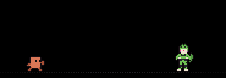

# Notch Fight

Pixel-art anime fights that drop out of the MacBook Pro notch while Claude Code is working.
Claude (the orange asterisk mascot) is always the protagonist.



## How it works

- `NotchFight.app` hangs a black panel from the notch's bottom edge (width = notch width,
  detected at runtime via `NSScreen.auxiliaryTopLeftArea/RightArea`) and plays the clips.
- Clicking the panel, or `SIGTERM` (`pkill -x NotchFight`), retracts it into the notch and quits.
- Claude Code hooks in `~/.claude/settings.json` drive it:
  - `UserPromptSubmit` → `open -g ~/Workspace/notch-fight/build/NotchFight.app`
  - `Stop` / `StopFailure` → `pkill -x NotchFight`

## Themes and loop keyframes

Each theme has its own neutral pose (the "loop keyframe"). Every clip of a theme starts and
ends on it, so clips of the same theme chain seamlessly. Switching theme plays a
pre-rendered asterisk-iris transition (`transitions/<from>__<to>`).

| Theme | Claude as | Opponent | Clips |
|---|---|---|---|
| `dbz` | Claude | Cell | beam, teleport, barrage, super, genki, standoff |
| `ygo` | Yugi-style duelist | Kaiba | duel |
| `kny` | Tanjiro-style swordsman | Akaza | breath |
| `jjk` | Gojo-style sorcerer | Sukuna | infinity |
| `fn` | Fortnite default with pickaxe | Geno | royale |
| `pkm` | Pokémon with Ash's cap | Mewtwo | psychic |
| `snk` | Survey Corps scout (ODM gear) | 5 titans + the Armored Titan | survey |

Playback: pick a random theme, play up to 2 of its clips (shuffle bag, no immediate
repeat), transition to another random theme, repeat.

## Forcing the first clip

Useful to test a new clip or to show one off. Value is a clip (`<theme>__<clip>`, e.g.
`fn__royale`), a whole theme (e.g. `ygo`), or a comma-separated list / JSON array of them,
played in order. After the forced clips, playback continues normally.

```bash
open -g build/NotchFight.app --args --first fn__royale     # one-off
open -g build/NotchFight.app --args --first pkm__psychic,snk__survey
NOTCH_FIGHT_FIRST=jjk ./build/NotchFight.app/Contents/MacOS/NotchFight
```

Or persistently (also applies to the Claude Code hook launches):

```bash
mkdir -p ~/.config/notch-fight && cp config.example.json ~/.config/notch-fight/config.json
```

Priority: `--first` arg > `NOTCH_FIGHT_FIRST` env > config file. An unknown name is logged
(with the list of valid names) and ignored. Clip names = folder names under `build/clips/`.

## Layout

- `src/clips.py` — sprite engine + DBZ clips.
- `src/themes.py` — YGO/KNY/JJK/Fortnite/Pokémon/SNK themes, transitions and the frame export (entry point).
- `src/single_clip.py` — the original standalone 10 s clip (`--black` for the notch version).
- `app/main.swift`, `app/Info.plist` — the notch app.
- `media/` — rendered previews.

## Build

```bash
./build.sh           # frames + app into build/
GIFS=1 ./build.sh    # also refresh media/clips/*.gif
```

Canvas is 185×64 art pixels = 185×64 pt on a 14" MacBook Pro (1 art px = 2 device px).

## Adding a clip

See `CLAUDE.md` for the rules (a new clip is auto-set to play first).

Write a `clip_<name>(f)` in `src/themes.py` (or `src/clips.py` for DBZ) that starts and ends on
the theme's neutral pose, register it in `THEMES`, rebuild. A new theme needs its own
neutral pose; transitions to/from it are generated automatically.
